<!-- _class: title-slide -->

# Replicating and Experimenting with the AlphaZero Algorithm on 4x4 Tic-Tac-Toe

**Herimampionona Andriniaina**  
PhD Progress Review   
Coventry University

**Supervisors:** Prof. James Brusey, Prof. Ulrich Paquet

---

## Goals

-  Understanding of all underlying AlphaZero (AZ) concepts  
- Train a perfect-play agent for 4×4 Tic-Tac-Toe and its variants.

---
# Environement: TicTacToe 4x4

A two-player 4×4 Tic-Tac-Toe game where the first to align 3 in a row wins.

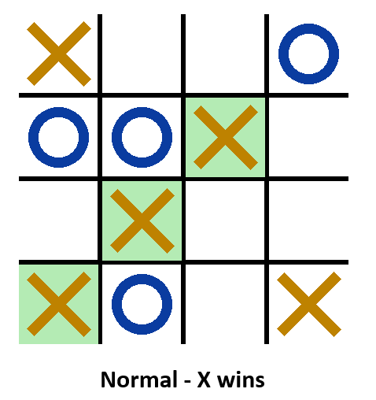

##

- Simple game and rule set for validation
- ~5 moves per game on average

<!-- **Addresses:** Data efficiency + Non-linear modeling barriers -->

---

# Environement: TicTacToe 4x4 - Misère

A 4×4 Tic-Tac-Toe with a modified win condition.

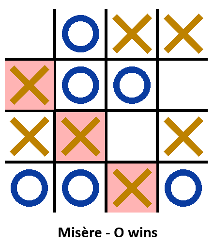

##

- ~14 moves per game on average (misère)
- Misère rules offers different strategies

<!-- **Addresses:** Data efficiency + Non-linear modeling barriers -->

---
# Why C++?

##
##

- MCTS requires millions of simulations → benefits from C++ performance
- Better control over memory and parallelization

<!-- **Addresses:** Data efficiency + Non-linear modeling barriers -->

---
# AZ Pipeline

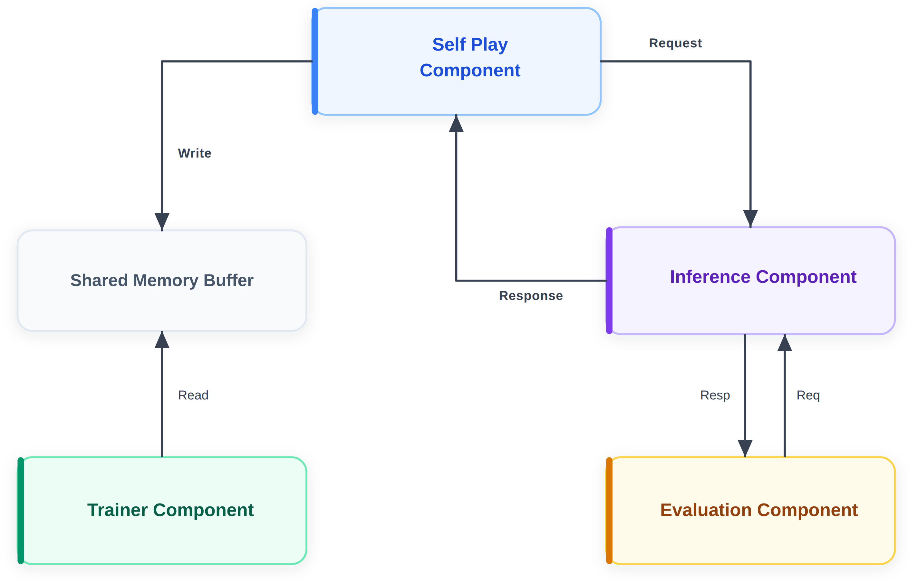

---

# Selfplay Component
<a href="html/selfplay-viewer.html">Open self-play animation</a>

---

# MCTS Algorithm
<a href="html/mcts-algorithm.html">Open MCTS vizualizer</a>

---

# Inference Component
<a href="html/inference-component.html">Open Inference viewer</a>

---

# Dataset structure

**Board state**: $
s \in \mathbb{[0,1]}^{3 \times 4 \times 4}
$

* Plane 1: 1 if the cell has a piece of the current player, 0 otherwise.
* Plane 2: 1 if the cell has a piece of the opponent, 0 otherwise.
* Plane 3: all 0s if current player = Player 1, all 1s if current player = Player 2.

**Mask** : $
m \in {[0,1]}^{16}, \quad m_a = 1 \text{ if action } a \text{ is legal}
$

**Policy**: $
\pi \in \mathbb{R}^{16}
$

**Value**: $
z \in [-1,1], \quad z = 1 \text{ win, } -1 \text{ loss, } 0 \text{ draw}
$

--- 

# Trainer Component

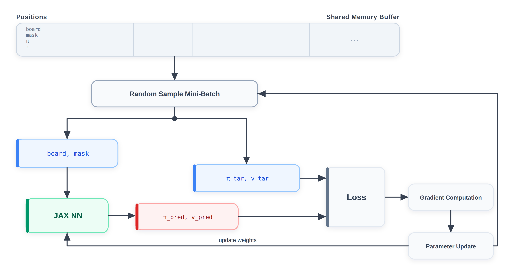

$$
\mathcal{L} = (z - v)^2 - \pi^T \log(p) + c |\theta|^2
$$

--- 

# NN Architechture
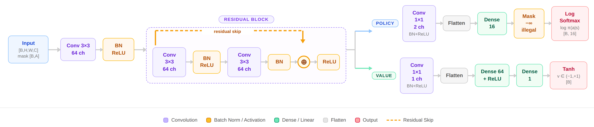

---
# Evaluation Component

- The trainer saves checkpoints periodically (every X steps)
- Each new checkpoint is treated as a candidate model
- The candidate is challenged against the current best model in a series of 400 games (alternate who goes first for fairness)
- If the candidate wins more than 55\% of decisive games, it is promoted to the new best model
- Otherwise, the current best model remains the best model.
---

<!-- _class: section-divider -->

# Training results

---

# Hyperparameters 
 The following parameters have been used for training:
| Parameter | Normal TTT 4x4 | Misère TTT 4x4 |
|-------|--------|--|
| **Min Positions** | 2 000 | 2000|
| **Batch Size** | 128 | 128|
| **Total Steps** | 2 500 | 5000|
| **Residual Blocks** | 3 | 3|
| **Learning Rate** | 0.001 | 0.001|
| **Weight Decay** | 1e-4 | 1e-4|
| **Replay Buffer Capacity**     | 50 000 positions| 50 000 positions|
| **Self-Play Workers** | 8 | 8|

---

# Self-play data statistics 
## Normal TTT 4x4 
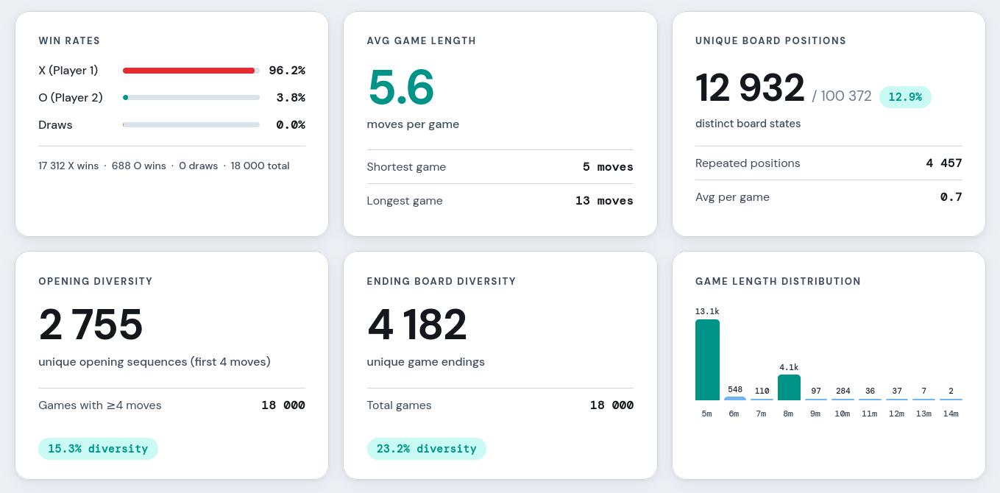

---

# Self-play data statistics 
## Misère TTT 4x4 
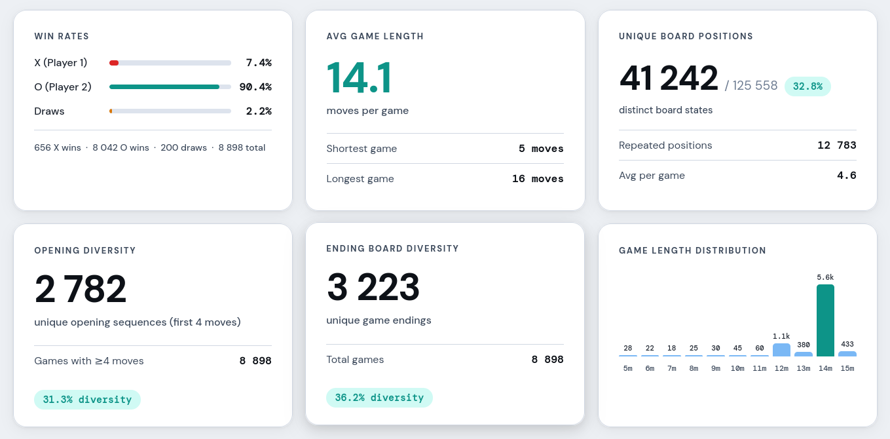

---

# Training metrics
## Normal TTT 4x4 

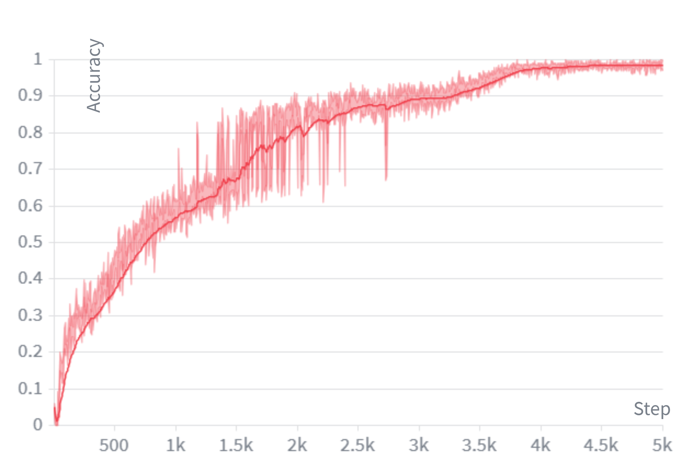

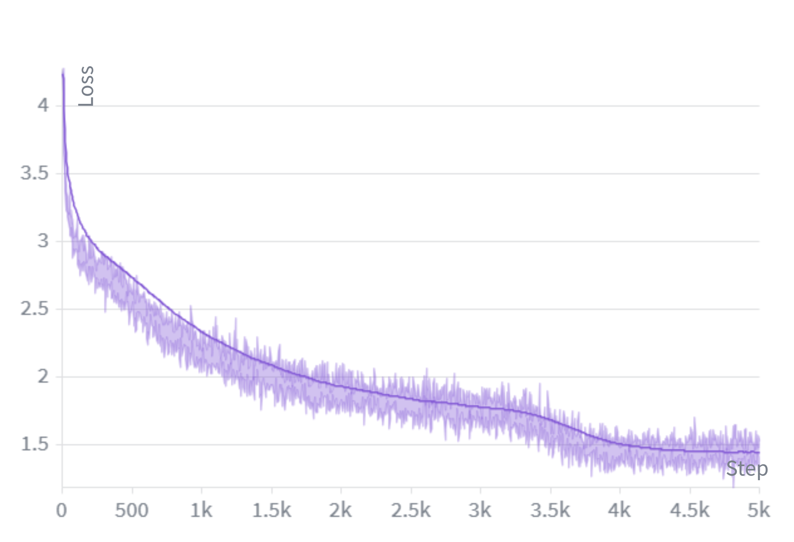

---

# Training metrics
## Misère TTT 4x4 

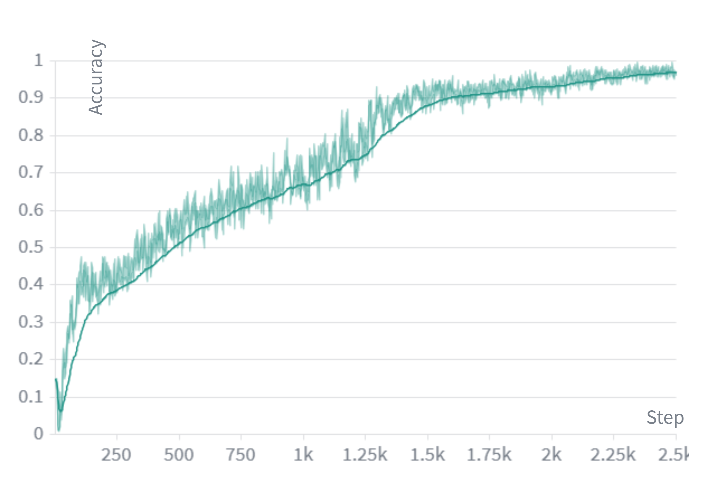

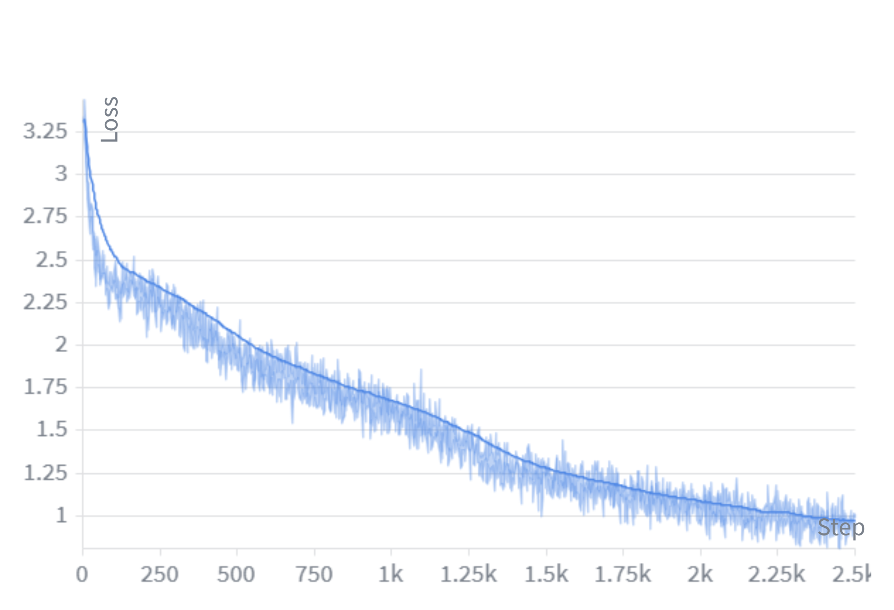

---

# Evaluation metrics

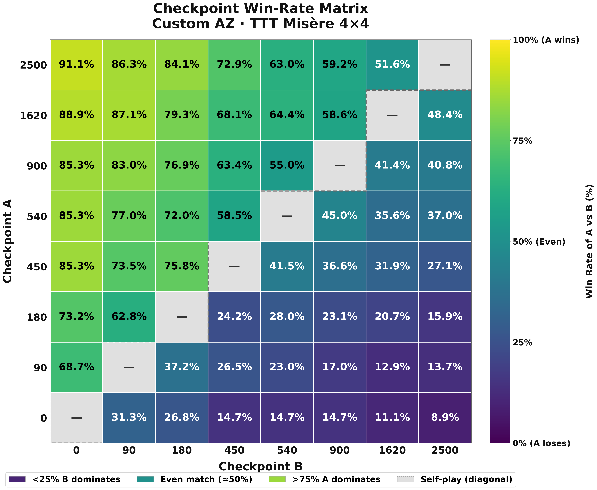

---

<!-- _class: section-divider -->

# Discussions and furture plans

---
# Discussions

- **Pipeline:**
Python -> C++ -> JAX?
- **Shared memory vs Triton Interface Server**
Shared memory wins on single machine; Triton better for scaling.

- **NN vs NN + MCTS**
Network alone plays well but makes occasional deep look-ahead errors, combined with MCTS it achieve perfect play.

---
# Challenges

- Paper and codee implementations gaps (e.g. storing Q/N in child nodes, not edges)
- Perspective bugs in MCTS backpropagation were the hard to catch.
- C++ is fast and efficient but shared memory setups and debug is complex.

----

<!-- _class: title-slide -->
# Future Plan

| Task | Description | Importance |
| ---- | ----------- | ---------- |
| **Concept probing for XAI** | Probe the internal representations of trained models to identify which concepts are encoded in their activations, improving interpretability of learned behaviors. | 🔴 Critical |
| **Migrate to more complex games** | Extend the current framework to support richer, more complex game environments. | 🟡 Moderate |
| **Port MCTS and the game to JAX (using XLA) for maximum scalability** | Use Google Deepmind library MCTX and a custom game logic in JAX to leverage XLA compilation and enable efficient GPU/TPU acceleration at scale. | 🟠 Important |

---

# Thank You

## Questions & Discussion

**Contact:**  
📧 andriniaih@uni.coventry.ac.uk  
📄 Coventry University

**Resources:**  
📂 [github.com/ainaherimam/tictactoe-alphazero-cpp ](https://github.com/ainaherimam/tictactoe-alphazero-cpp) 

